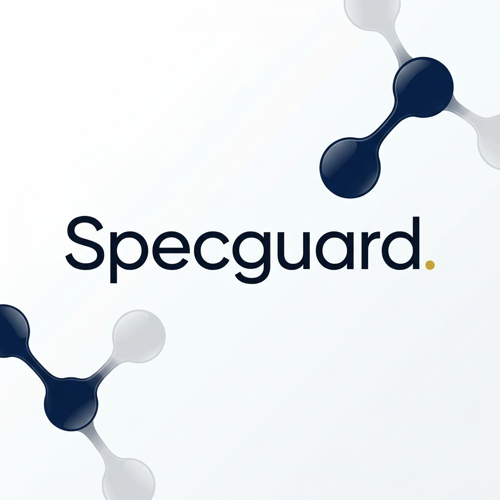
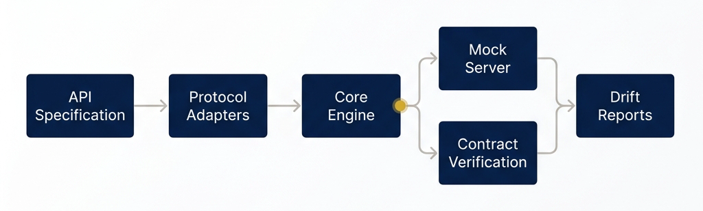

# Specguard



Project Specguard is a protocol-pluggable API mocking and contract-testing tool designed to simplify testing of service boundaries. It enables engineering teams to automatically stand up mock servers and verify downstream API conformance using normalized specification models. By isolating applications from their protocol details, Specguard prevents contract drift and ensures high-fidelity API simulation.

---

## Key Features

* **Protocol-Agnostic Core**: Model API behaviors, request/response shapes, and constraints independently of the underlying protocol.
* **Pluggable Protocol Adapters**: Full support for REST (OpenAPI 3.x) and gRPC (Protobuf) specifications.
* **Stateful Mocking & Scenarios**: Stand up dynamic mock servers that handle stateful CRUD operations and support named scenarios (e.g., success, not-found, server-error).
* **Fault & Chaos Injection**: Configure per-operation latency, failure rates, timeouts, and malformed payload injection.
* **Observability**: Built-in Prometheus `/metrics` endpoint and JSON structured logging.
* **Rust FFI Engine**: Leverages a high-performance Rust library for content hashing and structural diffing.
* **CI/CD Integration**: CLI support for JUnit XML and JSON output formats to gate builds on contract drift.

---

## Architecture Overview

Specguard parses protocol-specific API definitions into a normalized spec schema. This schema drives both the mock servers and the contract validation checks.



---

## Quick Start

### Building from Source

To build Specguard, you need Go 1.22+ and Rust 1.75+ installed.

1. **Build the Rust FFI Library**:
   ```bash
   cd rust
   cargo build --release
   cd ..
   ```
2. **Build the Go CLI and Server**:
   ```bash
   go build -o bin/specguard ./cmd/specguard
   ```

### Running with Docker

Build and run Specguard in a single container:

```bash
docker build -t specguard:latest .
docker run -d \
  -p 8080:8080 \
  -v specguard-data:/data \
  -e SPECGUARD_API_KEY=your-secure-api-key \
  specguard:latest
```

### Running with Docker Compose

Create a `docker-compose.yml` file and start the services:

```yaml
version: '3.8'

services:
  specguard:
    image: specguard:latest
    ports:
      - "8080:8080"
    environment:
      - SPECGUARD_PORT=8080
      - SPECGUARD_DB_DSN=/data/specguard.db
      - SPECGUARD_LOG_LEVEL=info
      - SPECGUARD_API_KEY=your-secure-api-key
    volumes:
      - specguard-data:/data
    restart: unless-stopped

volumes:
  specguard-data:
```

```bash
docker compose up -d
```

---

## CLI Usage

Specguard features a CLI that interacts with the HTTP API:

* **Start the Server**:
  ```bash
  specguard server
  ```
* **Add a Specification**:
  ```bash
  specguard spec add <spec-id> <path-to-file>
  ```
* **Start a Mock Server**:
  ```bash
  specguard mock start <spec-id>
  ```
* **Run Contract Verification**:
  ```bash
  specguard contract run <spec-id> <target-url>
  ```
* **Show Drift Reports**:
  ```bash
  specguard report show <run-id>
  ```

---

## Testing

Run the full Go test suite:

```bash
go test -v ./...
```

Run tests with the race detector enabled:

```bash
go test -v -race ./...
```
